# OpenAgentModel: Core Concepts & Architecture

This document outlines the core vision, threat models, and architectural components of **OpenAgentModel**.

---

## The Vision: Model-First Governance

Enterprise agent development today is code-first or framework-first. Developers bind tools, chain agents, and configure memory stores dynamically within Python or TypeScript scripts. While this is fast, it leaves security, compliance, and risk teams with no visual diagram, no static policy validations, and no standard CI gates.

OpenAgentModel introduces **design-time modeling**. Before you deploy an agent system, you model its static capabilities.

```mermaid
graph TD
  A[Design Time] -->|Define Architecture| B(agentmodel.yaml)
  B -->|oam validate| C{Semantic Linker}
  C -->|Failed| D[Print Broken References]
  C -->|Passed| E[Strong AST]
  E -->|oam risk| F[Static Rules and Experimental Policy Checks]
  E -->|oam diagram| G[Custom SVG Renderer]
  F -->|Policy-as-Code| H[Generate OPA Rego / AGT Configs]
  F -->|Static Scan| I[Export SARIF Logs to CI]
  F -->|HTML Dashboard| J[Interactive Governance Report]
  G --> J
  
  style B fill:#0f172a,stroke:#3b82f6,stroke-width:2px
  style C fill:#1e1b4b,stroke:#8b5cf6,stroke-width:2px
  style F fill:#351608,stroke:#f59e0b,stroke-width:2px
  style I fill:#450a0a,stroke:#ef4444,stroke-width:2px
```

---

## Agentic Vulnerabilities & Threat Vectors

Agents process untrusted payloads, take actions, and delegate tasks autonomously. This introduces threat models that do not exist in traditional request-response microservices.

### Threat Mapping

The following diagram illustrates how an untrusted API payload flows through the agent system, escalating permissions and bypassing gates:

```mermaid
graph LR
  subgraph Untrusted Boundary
    A["User Input / Untrusted API"]
  end
  subgraph Agentic Trust Zone
    B["Support Agent<br/>(Supervised)"]
    C["Refund Agent<br/>(Approval Gate Required)"]
  end
  subgraph High-Risk Assets
    D["Payment Gateway API"]
    E["PII Data Store"]
  end

  A -- "1. Indirect Prompt Injection<br/>(OWASP-1)" --> B
  B -- "2. A2A Delegation<br/>(Escalates Privilege)" --> C
  C -- "3. Unapproved Action<br/>(OWASP-8)" --> D
  B -- "4. Data Leakage<br/>(OWASP-6)" --> E

  style A fill:#450a0a,stroke:#ef4444,stroke-dasharray: 5 5
  style D fill:#450a0a,stroke:#ef4444
  style C fill:#1e1b4b,stroke:#8b5cf6
  style B fill:#1e1b4b,stroke:#8b5cf6
```

`oam` maps findings to the OWASP Top 10 for LLM Applications 2025 and emerging agentic application security patterns. It does not claim coverage of an official future agent-specific OWASP list.

### Key Risk Categories Audited by `oam`:

1. **A2A Privilege Escalation (Emerging Agentic Pattern)**: 
   If Agent A can delegate to Agent B, but B has access to high-risk tools (e.g. payout APIs) that A is blocked from calling, Agent A can escalate privileges indirectly by calling B.
2. **Excessive Agency & Autonomous Tool Runs (OWASP LLM08:2025)**: 
   Destructive or financial tools must require human approval gates (`requires_human_approval: true`, `approval.mode: human`, `approval.mode: multi-party`, or agent-level `approval_required_for`). Agents with write tool permissions must not run with fully autonomous autonomy levels unless explicitly verified.
3. **Indirect Prompt Injection (OWASP LLM01:2025)**: 
   Untrusted inputs read by tool execution layers (e.g. database logs) can feed instructions back to the LLM agent, hijacking the agent's prompt to bypass security limits.
4. **Memory Poisoning (OWASP LLM03:2025)**: 
   If an agent can write directly to its vector memory stores without poisoning safeguards, malicious instructions can be stored permanently, polluting future retrieval cycles.
5. **PII Exfiltration (OWASP LLM02:2025)**: 
   Agents touching sensitive data classes (classified as PII or credentials) must not route commands or payloads to external or untrusted MCP servers.
