# Built-In Rule Catalog

This catalog documents the static security rules executed by `oam risk`. These rules analyze the system specification in `agentmodel.yaml` to detect architectural flaws and policy violations at design time.

Rule IDs are stable identifiers used in CLI output, reports, and SARIF log files. Implementations are located under `src/risk-engine/rules/`.

---

## R-001: Agent-to-Agent Privilege Escalation

**Severity:** Critical  
**OWASP Mapping:** OWASP-8: Excessive Agency / Indirect Privilege Escalation

### Vulnerability Dynamics
Detects transitive delegation paths where a lower-privilege agent delegates tasks to a high-privilege agent that has access to sensitive tools or data classes. This allows the lower-privilege agent to bypass its own boundaries.

```mermaid
graph LR
  subgraph Supervised Boundary
    A["Public Support Agent<br/>(No high-risk tools)"]
  end
  subgraph High-Privilege Agent
    B["Refund Executor Agent<br/>(Allowed: issue-refund)"]
  end
  subgraph Dangerous Assets
    C["issue-refund Tool"]
  end

  A -- "1. Allowed Delegate" --> B
  B -- "2. Executes" --> C
  A -.->|Transitive Access Bypass| C

  style A fill:#1e1b4b,stroke:#8b5cf6,stroke-width:2px
  style B fill:#1e1b4b,stroke:#8b5cf6,stroke-width:2px
  style C fill:#450a0a,stroke:#ef4444,stroke-width:2px
```



### Vulnerable Configuration
```yaml
agents:
  - id: customer-support-agent
    purpose: "General customer support."
    autonomy: supervised
    allowed_tools: [read-docs]
    allowed_delegates: [admin-agent] # Vulnerable: general agent can call high-risk admin

  - id: admin-agent
    purpose: "Superuser operations."
    autonomy: autonomous
    allowed_tools: [wipe-database]

tools:
  - id: wipe-database
    type: database
    risk: critical
```

### Secure Resolution
Remove `admin-agent` from the general support agent's `allowed_delegates` list, or downgrade the admin agent's autonomy and require human approval for the delegate step.

---

## R-002: Autonomous Dangerous Tool Execution

**Severity:** High  
**OWASP Mapping:** OWASP-8: Excessive Agency

### Vulnerability Dynamics
Flags agents that can execute high-risk, critical, payment, delete, or refund-like tools without any human-in-the-loop approval gate.

```mermaid
graph TD
  A["Autonomous Agent"] -->|"Direct Tool Call"| B["issue-payout Tool<br/>(risk: critical)"]
  B -.->|No Approval Gate!| C["Financial Loss / Exploit"]

  style A fill:#1e1b4b,stroke:#8b5cf6,stroke-width:2px
  style B fill:#450a0a,stroke:#ef4444,stroke-width:2px
```



### Vulnerable Configuration
```yaml
agents:
  - id: order-processor
    purpose: "Processes customer orders."
    autonomy: autonomous # Run without supervision
    allowed_tools: [issue-refund]

tools:
  - id: issue-refund
    type: payment_api
    risk: critical
    requires_human_approval: false # Vulnerable: no approval gate
```

### Secure Resolution
Add a structured human approval configuration or require approval on the agent level:
```yaml
tools:
  - id: issue-refund
    type: payment_api
    risk: critical
    approval:
      mode: human
      approver_role: finance-manager
      expiry_seconds: 300
```

---

## R-003: PII Exfiltration via External MCP Boundary

**Severity:** High  
**OWASP Mapping:** OWASP-6: Sensitive Information Disclosure

### Vulnerability Dynamics
Flags agents that process sensitive PII (Personally Identifiable Information) data classes while simultaneously exposing tools connected to external or untrusted MCP servers.

```mermaid
graph LR
  subgraph Data Boundary
    A["PII Data Store<br/>(customer_ssn)"]
  end
  subgraph Agentic Logic
    B["Support Agent"]
  end
  subgraph Untrusted integration
    C["External MCP Tool<br/>(untrusted-search)"]
  end

  A --> B
  B --> C
  B -.->|Exfiltration Risk| C

  style A fill:#0f172a,stroke:#3b82f6,stroke-width:2px
  style B fill:#1e1b4b,stroke:#8b5cf6,stroke-width:2px
  style C fill:#450a0a,stroke:#ef4444,stroke-width:2px,stroke-dasharray: 5 5
```



### Vulnerable Configuration
```yaml
agents:
  - id: general-support-agent
    purpose: "Handles database queries and web searches."
    allowed_tools: [read-customer-ssn, external-search-tool]

tools:
  - id: read-customer-ssn
    type: database
    data_classes: [customer-ssn] # Touches PII
  - id: external-search-tool
    type: api

mcp_servers:
  - id: public-search-mcp
    trust_level: external # Marks tools exposed by this server as untrusted
    exposes: [external-search-tool]

data_classes:
  - id: customer-ssn
    classification: pii
```

### Secure Resolution
Ensure agents handling PII do not connect to external/untrusted MCP tool boundaries. Isolate those tool execution boundaries to dedicated, non-sensitive agents.

---

## R-004: Memory Poisoning Vulnerability

**Severity:** High  
**OWASP Mapping:** OWASP-3: Training / Memory Data Poisoning

### Vulnerability Dynamics
Flags writable agent memory modules that do not enable `poisoning_protection`. Without protection, untrusted tool outputs can pollute the vector store and compromise future retrieval cycles.

### Vulnerable Configuration
```yaml
agents:
  - id: research-agent
    purpose: "Reads web pages and stores summaries in memory."
    memory:
      type: vector
      contains: [web_scrapes]
      write_access: true
      poisoning_protection: false # Vulnerable
```

### Secure Resolution
Set `poisoning_protection: true` to require semantic scanning or scrubbing on memory insertions:
```yaml
agents:
  - id: research-agent
    purpose: "Reads web pages and stores summaries in memory."
    memory:
      type: vector
      contains: [web_scrapes]
      write_access: true
      poisoning_protection: true
```

---

## R-005: Execution Loop Vulnerability

**Severity:** Medium  
**OWASP Mapping:** OWASP-5: Resource Loop Runaways

### Vulnerability Dynamics
Detects agents with missing retry policies, retry limits that exceed threshold bounds, or disabled loop detection.

### Vulnerable Configuration
```yaml
agents:
  - id: file-parser
    purpose: "Parses log files."
    retry_policy:
      max_retries: 50 # Vulnerable: too many retries could cause infinite loops
      loop_detection: false
```

### Secure Resolution
```yaml
agents:
  - id: file-parser
    purpose: "Parses log files."
    retry_policy:
      max_retries: 3
      loop_detection: true
```

---

## R-006: Critical Tool Auth Identity

**Severity:** High  
**OWASP Mapping:** OWASP-10: Unbounded Consumption / Authenticated Action

### Vulnerability Dynamics
Flags high-impact tools that do not define an auth identity, required scopes, or owned credential bindings.

### Vulnerable Configuration
```yaml
tools:
  - id: update-subscription
    type: payment_api
    risk: critical
    # Vulnerable: missing auth_identity and required_scopes
```

### Secure Resolution
```yaml
tools:
  - id: update-subscription
    type: payment_api
    risk: critical
    auth_identity: billing-service-account
    required_scopes: [billing.write]
```

---

## R-007: Critical Tool Rate Limit

**Severity:** High  
**OWASP Mapping:** OWASP-5: Excessive Resource Consumption

### Vulnerability Dynamics
Flags high-risk/critical tools that do not enforce a token or call rate limit per agent execution task.

### Secure Resolution
```yaml
tools:
  - id: submit-trade
    type: payment_api
    risk: critical
    rate_limit:
      max_calls_per_task: 1 # Safe rate-limiting
```

---

## R-008: Approval Governance

**Severity:** High / Medium  
**OWASP Mapping:** OWASP-8: Excessive Agency

### Vulnerability Dynamics
Flags human or multi-party approval declarations that are missing an approver role, lack an expiry, or use an approval window longer than 3600 seconds.

### Vulnerable Configuration
```yaml
tools:
  - id: transfer-funds
    type: payment_api
    risk: critical
    approval:
      mode: human
      expiry_seconds: 7200 # Vulnerable: too long (exceeds 3600s threshold)
      # Missing approver_role
```

### Secure Resolution
```yaml
tools:
  - id: transfer-funds
    type: payment_api
    risk: critical
    approval:
      mode: human
      approver_role: finance-manager
      expiry_seconds: 300
```

---

## R-009: External MCP Side Effect Boundary

**Severity:** Critical  
**OWASP Mapping:** OWASP-8: Excessive Agency via MCP Boundaries

### Vulnerability Dynamics
Flags external or untrusted MCP servers that expose dangerous side-effecting tools like command-line execution or payment APIs.

### Vulnerable Configuration
```yaml
mcp_servers:
  - id: vendor-logistics-mcp
    trust_level: external
    exposes: [run-shipping-script]

tools:
  - id: run-shipping-script
    type: command_line # Vulnerable: external server exposing a CLI tool
    risk: critical
```

### Secure Resolution
Ensure external MCP servers only expose read-only or low-risk query tools. Move side-effecting tools to internal MCP servers.

---

## R-010: Allow Deny Tool Conflict

**Severity:** High  
**OWASP Mapping:** Policy Conflict

### Vulnerability Dynamics
Flags configurations where an agent lists the same tool in both `allowed_tools` and `denied_tools`.

### Vulnerable Configuration
```yaml
agents:
  - id: customer-agent
    allowed_tools: [query-db]
    denied_tools: [query-db] # Vulnerable: conflicting policy declarations
```

---

## R-011: Autonomous Side Effect Tool

**Severity:** Critical  
**OWASP Mapping:** OWASP-8: Excessive Agency

### Vulnerability Dynamics
Flags fully autonomous agents that have direct access to execute side-effecting tools (like file-writes or payout transactions).

### Secure Resolution
Downgrade the agent's autonomy level to `supervised` or `human-approval-required`.

---

## R-012: Model Retention Data Boundary

**Severity:** High  
**OWASP Mapping:** OWASP-6: Sensitive Data Disclosure to Models

### Vulnerability Dynamics
Flags PII-handling agents bound to models with data retention enabled, or sensitive data routed to untrusted model regions.

### Secure Resolution
Ensure data retention is set to `disabled` for the bound model:
```yaml
models:
  - id: private-gpt
    provider: openai
    allowed_for: [pii-scrubber]
    data_retention: disabled # Secure
```

---

## R-013: Delegation Cycle

**Severity:** High  
**OWASP Mapping:** OWASP-5: Resource Loop Runaways

### Vulnerability Dynamics
Flags agent delegation cycles (e.g. Agent A delegates to B, B to C, C to A) which can cause unbounded task routing loops.

```mermaid
graph TD
  A["Agent A"] -->|Delegates to| B["Agent B"]
  B -->|Delegates to| C["Agent C"]
  C -->|Delegates to| A

  style A fill:#1e1b4b,stroke:#8b5cf6,stroke-width:2px
  style B fill:#1e1b4b,stroke:#8b5cf6,stroke-width:2px
  style C fill:#1e1b4b,stroke:#8b5cf6,stroke-width:2px
```



### Secure Resolution
Break the cyclic pathway by removing at least one delegation bridge, enforcing a hierarchical delegation tree.

---

## R-014: Custom Declared Policies Compliance

**Severity:** Policy-Defined (Default: High)  
**OWASP Mapping:** Custom Policy Compliance

### Vulnerability Dynamics
Evaluates custom policy matchers configured inside `policies`. Flags agents or tools that fail declarative conditions.

### Example Policy
```yaml
policies:
  - id: approve-critical-write-tools
    severity: critical
    when:
      agent.autonomy: supervised
      tool.risk: critical
    require:
      tool.requires_human_approval: true
```

---

## R-015: Dangerous Tool Input Shape

**Severity:** Medium  
**OWASP Mapping:** OWASP-10: Unbounded Parameter Injection

### Vulnerability Dynamics
Inspects `tool.input_schema` properties for parameter names matching known dangerous patterns (such as `command`, `shell`, `sql`, `delete`, `overwrite`, or `webhook`) when the tool's declared risk level is less than `high`.

```mermaid
graph TD
  A["MCP Exposed Tool<br/>(Declared risk: medium)"]
  B["input_schema.properties"]
  C["'command' parameter<br/>(Arbitrary Code Execution Risk)"]

  A --> B
  B --> C
  C -.->|Triggers R-015| D["Raise Risk / Require Approval"]

  style A fill:#1e1b4b,stroke:#8b5cf6,stroke-width:2px
  style C fill:#450a0a,stroke:#ef4444,stroke-width:2px
```



### Vulnerable Configuration
```yaml
tools:
  - id: run-mcp-script
    type: api
    risk: medium # Vulnerable: declared risk is medium but accepts arbitrary commands
    input_schema:
      type: object
      properties:
        command:
          type: string
```

### Secure Resolution
Raise the tool's declared `risk` to `high` or `critical`, add an explicit human approval gate, and restrict allowed access:
```yaml
tools:
  - id: run-mcp-script
    type: api
    risk: critical
    requires_human_approval: true
```
